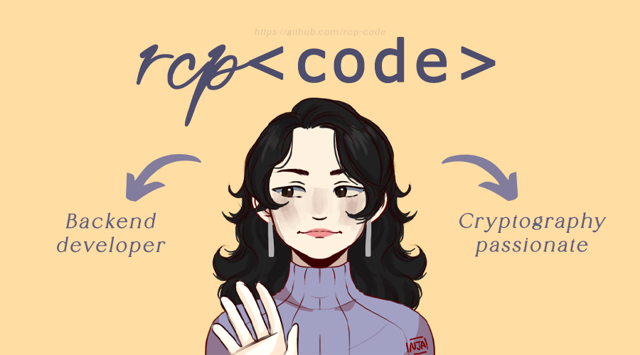

 

## 🌟 Hello and welcome! I'm Ro 👋👩‍💻

Developer specialised in **backend** and software. I love coding and bringing ideas to life in every project. I work with several programming languages, but lately, my favourites are **Go**, **Haskell**, and **Java**. 💻

#### 📍 A little about me

 - **Languages I speak**: Spanish (native 🇪🇸), English (B2, pretty good at it! 🇬🇧), and I’m learning German (quite a challenge, but getting there 🇩🇪).
 - **Topics I’m passionate about**: Cryptography 🔐, artificial intelligence 🤖, remote sensing 🌍 and blockchain 📈.
 - **Personal interests**: When I’m not coding, you’ll probably find me drawing 🎨, reading fiction 📚, learning about any topic that catches my interest or watching videos on Youtube 🎞.

#### 💡 Tech Stack
 - **Languages**: Go, Haskell, Java, Python.
 - **Tools & Frameworks**: GORM, Go Modules, Go Kit, Cabal, QuickCheck, Spring Boot, Maven, JUnit, Django, NumPy.
 - **Databases**: MySQL, SQLite, PostgreSQL.
 - **User Interface Development (UI/UX)**: HTML/CSS, TypeScript, Figma.
 - **APIs/Protocols**: REST (JSON).

#### 🚀 Right now…
I’m working on **backend projects in Go**. My main goals are to keep learning, improving, and taking each project to the next level.

#### 🌐 Let’s connect!
If you’re curious, full of ideas, and interested in collaborating, feel free to reach out! I love connecting with people from all over the world and learning from different perspectives.

Versión en español 🇪🇸

  

### 🌟 ¡Hola! Soy Ro 👋👩‍💻

Desarrolladora de software apasionada por el **backend** que siempre busca nuevos desafíos. Me encanta programar y ver cómo cobran vida las ideas. Trabajo con varios lenguajes, pero actualmente mis favoritos son **Go**, **Haskell** y **Java**. 💻

#### 📍 Un poco sobre mí
- **Idiomas**: Hablo español (¡nativo! 🇪🇸), inglés (B2, ¡me defiendo bien! 🇬🇧), y estoy aprendiendo alemán (todo un reto, pero ahí vamos 🇩🇪).
- **Áreas que me apasionan**: Criptografía 🔐, inteligencia artificial 🤖, teledetección 🌍 y, últimamente, blockchain 📈.
- **Intereses personales**: Cuando no estoy programando, probablemente esté dibujando 🎨, leyendo algo de ficción 📚, aprendiendo sobre cualquier tema que despierte mi curiosidad o viendo vídeos en Youtube 🎞.

#### 💡 Stack de Tecnologías
- **Lenguajes**: Go, Haskell, Java, Python.
- **Herramientas y Frameworks**: GORM, Go Modules, Go Kit, Cabal, QuickCheck, Spring Boot, Maven, JUnit, Django, NumPy.
- **Bases de datos**: MySQL, SQLite, PostgreSQL.
- **Desarrollo de Interfaces de Usuario (UI/UX)**: HTML/CSS, TypeScript, Figma.
- **APIs/Protocolos**: REST (JSON).
- **Control de versiones**: GitHub.

#### 🚀 Actualmente…
Estoy enfocada en proyectos de **backend en Go**. Mi objetivos son aprender, mejorar y llevar cada proyecto al siguiente nivel.

#### 🌐 ¿Hablamos?
Si eres una persona curiosa, con ideas innovadoras y ganas de colaborar, ¡contáctame! Me encanta conocer gente nueva de la que poder aprender y con la que compartir distintos puntos de vista.

 
 

